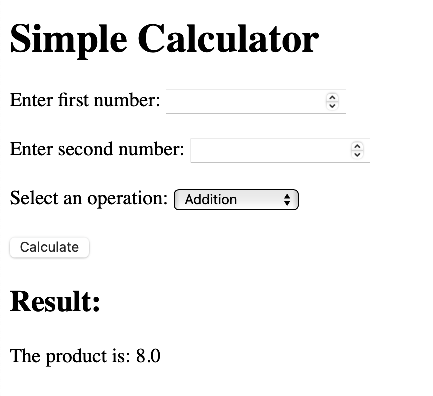
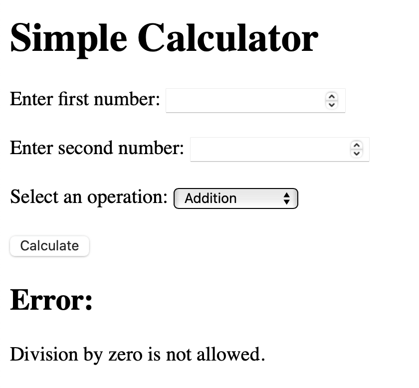
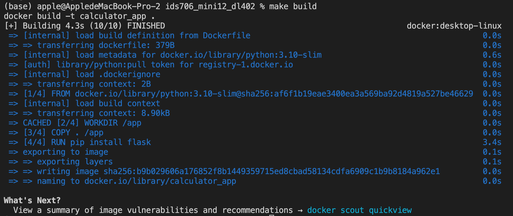
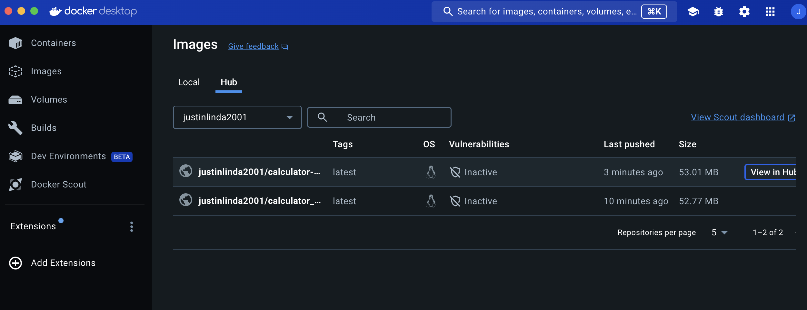

[](https://github.com/Da-Justin-Lin/ids706_mini12_dl402/actions/workflows/cicd.yml)

## Repository Structure
```
ids706_mini12_dl402/
├── app.py                 # Main Python application
├── Dockerfile             # Dockerfile for containerization
├── requirements.txt       # Python dependencies
├── Makefile
├── .github/
│   └── workflows/
│       └── cicd.yml   # CI/CD pipeline configuration
└── README.md              # Project documentation
```

## Overview
This repository is a part of the **IDS706 Mini Project 12**, focused on exploring dockerized applications. It includes:

- A Python-based application for web interactive calculator.
- Implementation of containerization with Docker.
- CI/CD workflows using GitHub Actions for automated builds and deployments.


## Features
- **Python Application**: The Python app performs calculations and provides a simple web interface. 
- **Containerization**: The application is containerized using Docker for portability and ease of deployment.
- **CI/CD Pipeline**: Automated Docker image build and push to Docker Hub.




## Getting Started

### Prerequisites
- Python 3.10 or later
- Docker
- Git

### Installation
1. Clone this repository:
   ```bash
   git clone git@github.com:Da-Justin-Lin/ids706_mini12_dl402.git
   ```
2. Navigate to the project directory:
   ```bash
   cd ids706_mini12_dl402
   ```
3. Install dependencies (if running locally):
   ```bash
   pip install -r requirements.txt
   ```

## Running the Application

### Using Docker
1. Build the Docker image:
   ```bash
   make build
   ```
2. Run the Docker container:
   ```bash
   make run
   ```
3. Push to Docker Hub:
   ```bash
   make push
   ```



## CI/CD Pipeline
The repository includes a GitHub Actions workflow to:
1. Build the Docker image.
2. Push the image to Docker Hub or another container registry.

To trigger the pipeline, push changes to the `main` branch.